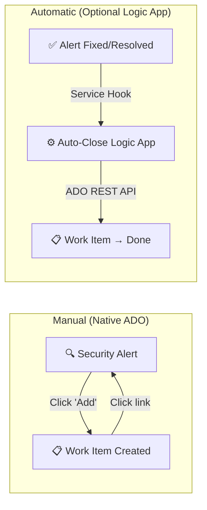

# GHAzDO → ADO Work Item Integration

Create and manage Azure DevOps work items from GitHub Advanced Security for Azure DevOps (GHAzDO) security alerts.

## Quick Start: One-Click Work Item Creation (Recommended)

Azure DevOps now has a **native button** to create work items directly from security alerts — no Logic App needed.

1. Go to your ADO project → **Repos** → **Advanced Security**
2. Open any security alert (code scanning, dependency, or secret scanning)
3. In the alert details, find the **"Related Work"** section
4. Click **"Add"** → Create a new work item or link to an existing one

**That's it.** The alert and work item are bidirectionally linked. No infrastructure, no webhooks, no maintenance.

> 📖 See [docs/quickstart-work-item-from-alert.md](docs/quickstart-work-item-from-alert.md) for the full guide.

## Architecture



| Capability | How It Works | Setup Required |
|---|---|---|
| **Create work item from alert** | Native ADO button (click "Add") | None — built into ADO |
| **Auto-close on fix/resolve** | Optional Logic App (see below) | One-click deploy |

## Optional: Auto-Close Logic App

If you want work items to **automatically close** when vulnerabilities are fixed, deploy the lightweight auto-close Logic App. It only handles closing — no work item creation logic.

### Prerequisites

- **Azure subscription** with permissions to create Logic Apps
- **Azure DevOps** PAT with `Work Items (Read & Write)` scope
- **GHAzDO** enabled on your ADO repository

### Deploy

```powershell
# One-command deploy
az deployment group create \
  --resource-group "rg-ghazdo-autoclose" \
  --template-file infra/deploy-autoclose.bicep \
  --parameters adoOrganization="YOUR_ORG" adoProject="YOUR_PROJECT" adoPat="YOUR_PAT"
```

After deployment, configure an **ADO Service Hook** to send alert state-change events to the Logic App's trigger URL (shown in deployment output).

### How It Works

1. GHAzDO marks a vulnerability as `fixed` or `resolved`
2. ADO Service Hook sends the event to the Logic App
3. Logic App queries ADO for open work items with the matching tag
4. Transitions the work item to **Done** with a history comment

> **Note:** The auto-close workflow uses the tag format `GHAzDO-{repoName}-{alertId}` to find matching work items. If your ADO process template uses "Closed" instead of "Done", update the `System.State` value in `infra/workflows/ghazdo-autoclose-only.json`.

## File Structure

```
├── README.md                                  # This file
├── docs/
│   ├── quickstart-work-item-from-alert.md     # One-page native ADO guide
│   ├── customer-response-native-feature.md    # Customer communication template
│   └── setup-guide.md                         # Detailed setup guide
├── infra/
│   ├── deploy-autoclose.bicep                 # Standalone auto-close deployment
│   ├── main.bicep                             # Full deployment (all Logic Apps)
│   ├── parameters.json                        # Deployment parameters
│   ├── modules/
│   │   ├── autoclose-logic-app.bicep          # Auto-close Logic App module
│   │   ├── logic-app.bicep                    # Full GHAS sync Logic App module
│   │   └── secret-scan-logic-app.bicep        # Secret scan Logic App module
│   └── workflows/
│       ├── ghazdo-autoclose-only.json         # Auto-close only workflow (recommended)
│       ├── ghas-to-ado.json                   # Full GHAS → ADO workflow
│       ├── ghazdo-to-ado.json                 # Full GHAzDO → ADO workflow
│       └── secret-scan-to-ado.json            # Secret scan workflow
├── scripts/
│   ├── deploy.ps1                             # Azure deployment script
│   └── setup-webhooks.ps1                     # Webhook configuration
└── docs/archive/                              # Legacy guides and walkthroughs
```

## Full Automation (Legacy)

The original Logic App workflows (`ghas-to-ado.json`, `ghazdo-to-ado.json`) provide full automation — auto-creating AND auto-closing work items via webhooks. These remain available for teams that prefer fully unattended operation. See [docs/setup-guide.md](docs/setup-guide.md) for the full deployment guide.

## Troubleshooting

| Issue | Resolution |
|---|---|
| "Add" button not visible in alerts | Ensure GHAzDO is enabled on the repository |
| Auto-close not triggering | Verify ADO Service Hook is configured and pointing to the Logic App trigger URL |
| Work item not closing | Check that work item has the matching `GHAzDO-{repo}-{alertId}` tag |
| "Forbidden" from ADO API | Ensure the ADO PAT has "Work Items: Read & Write" scope |

## References

- [Work Item Linking for Advanced Security Alerts (MS Blog)](https://devblogs.microsoft.com/devops/work-item-linking-for-advanced-security-alerts-now-available/)
- [Link Work Items to Advanced Security Alerts (MS Docs)](https://learn.microsoft.com/en-us/azure/devops/boards/backlogs/add-link?view=azure-devops&tabs=browser#link-work-items-to-advanced-security-alerts)
- [Configure GHAzDO Features (MS Docs)](https://learn.microsoft.com/en-us/azure/devops/repos/security/configure-github-advanced-security-features)

## License

Internal use — Learfield.
