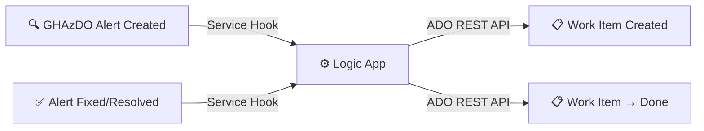

# GHAzDO → ADO Work Item Automation

Automatically create and close Azure DevOps work items when GHAzDO security alerts appear and resolve.

## Deploy to Azure

**Alerts from Azure DevOps (GHAzDO):**

[](https://portal.azure.com/#create/Microsoft.Template/uri/https%3A%2F%2Fraw.githubusercontent.com%2Fsautalwar%2Fghas-ado-logic-app%2Fmaster%2Finfra%2Fazuredeploy.json)

**Alerts from GitHub (GHAS) → Azure Boards:**

[](https://portal.azure.com/#create/Microsoft.Template/uri/https%3A%2F%2Fraw.githubusercontent.com%2Fsautalwar%2Fghas-ado-logic-app%2Fmaster%2Finfra%2Fazuredeploy-ghas.json)

> The portal "Deploy to Azure" button requires an ARM **JSON** template. The buttons point at
> `infra/azuredeploy.json` / `infra/azuredeploy-ghas.json`, which are compiled from the matching
> `.bicep` files. After changing a `.bicep`, recompile with
> `az bicep build --file infra/<name>.bicep --outfile infra/<name-output>.json`.
> For the GitHub (GHAS) flow, see [docs/github-webhook-setup.md](docs/github-webhook-setup.md).

## How It Works

**Zero manual intervention.** Three simple steps:

1. **GHAzDO detects vulnerability** → ADO Service Hook fires → **Logic App creates work item**
2. **Vulnerability fixed** → Service Hook fires → **Logic App closes work item**
3. **Done** — No manual updates needed



## 5-Minute Setup

1. **Click Deploy to Azure button** (above)
2. **Fill in 3 fields:** ADO organization, project name, and Personal Access Token (PAT)
3. **Copy trigger URL** from deployment outputs
4. **Configure 2 ADO Service Hooks** (see [docs/ado-service-hook-setup.md](docs/ado-service-hook-setup.md))
5. **Done** — Alerts and work items sync automatically

## What Gets Deployed

- **1 Azure Logic App** (~$50–100/month)
- **Handles:** Secret scanning, dependency scanning, and code scanning alerts
- **Auto-creates work items** with severity-based priority
- **Auto-closes work items** when vulnerabilities are fixed
- **Tag-based deduplication** — prevents duplicate work items for the same alert

## Prerequisites

- Azure subscription (free tier eligible)
- Azure DevOps PAT with `Work Items: Read & Write` scope
- GHAzDO enabled on your ADO repository

## Supplementary: Native ADO Button

Azure DevOps also provides a built-in **"Related Work"** button for manual one-off work item creation from alerts. Perfect for quick links or bulk operations.

See [docs/quickstart-work-item-from-alert.md](docs/quickstart-work-item-from-alert.md) for the one-page guide.

## File Structure

```
├── README.md                                  # This file
├── docs/
│   ├── ado-service-hook-setup.md              # Configure ADO Service Hooks
│   ├── quickstart-work-item-from-alert.md     # Native ADO "Related Work" guide
│   ├── setup-guide.md                         # Full deployment guide
│   └── customer-response-native-feature.md    # Customer communication template
├── infra/
│   ├── deploy-full-automation.bicep           # Full automation deployment
│   ├── deploy-autoclose.bicep                 # Auto-close only (legacy)
│   ├── main.bicep                             # All Logic Apps (legacy)
│   ├── parameters.json                        # Deployment parameters
│   ├── modules/
│   │   ├── logic-app.bicep                    # Full GHAzDO → ADO module
│   │   ├── autoclose-logic-app.bicep          # Auto-close Logic App module
│   │   └── secret-scan-logic-app.bicep        # Secret scan module
│   └── workflows/
│       ├── ghazdo-to-ado.json                 # Full GHAzDO → ADO workflow
│       ├── ghas-to-ado.json                   # Full GHAS → ADO workflow
│       ├── ghazdo-autoclose-only.json         # Auto-close only workflow
│       └── secret-scan-to-ado.json            # Secret scan workflow
├── scripts/
│   ├── deploy.ps1                             # Azure deployment script
│   └── setup-webhooks.ps1                     # Webhook configuration
└── docs/archive/                              # Archived guides
```

## Troubleshooting

| Issue | Resolution |
|---|---|
| Logic App not triggering | Verify ADO Service Hook is configured with the correct trigger URL |
| Work item not created | Check that alert is in a `created` or `appeared` state |
| Work item not closing | Ensure work item has the matching `GHAzDO-{repo}-{alertId}` tag |
| "Forbidden" from ADO API | Verify ADO PAT has `Work Items: Read & Write` scope and has not expired |
| Native "Add" button not visible | Ensure GHAzDO is enabled on the repository |

## References

- [Work Item Linking for Advanced Security Alerts (MS Blog)](https://devblogs.microsoft.com/devops/work-item-linking-for-advanced-security-alerts-now-available/)
- [Link Work Items to Advanced Security Alerts (MS Docs)](https://learn.microsoft.com/en-us/azure/devops/boards/backlogs/add-link?view=azure-devops&tabs=browser#link-work-items-to-advanced-security-alerts)
- [Configure GHAzDO Features (MS Docs)](https://learn.microsoft.com/en-us/azure/devops/repos/security/configure-github-advanced-security-features)

## License

Internal use — Learfield.
